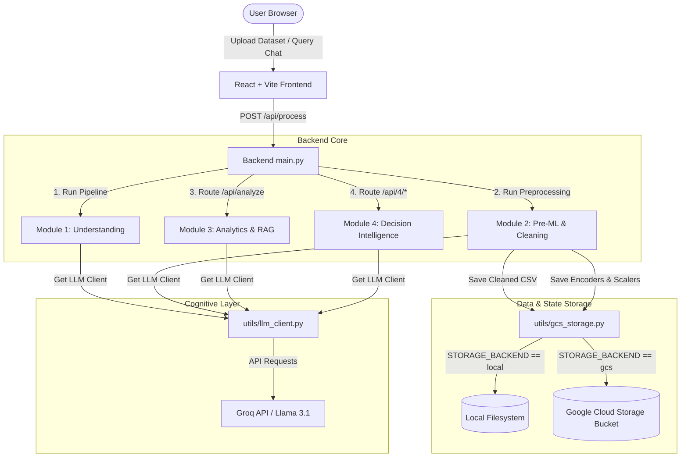
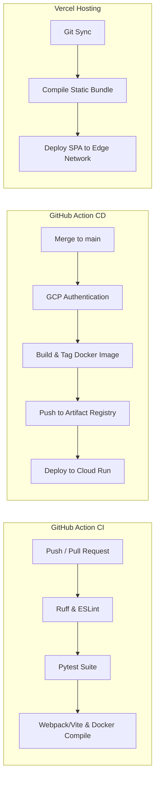

# Technical Architecture & Data Flow

This document details the internal systems design, file-by-file communication, agent interactions, and ML techniques powering the AI Decision Intelligence Platform.

---

## 🧠 System Architecture Overview

The system is a decoupled, single-entry full-stack web application. The frontend communicates with the FastAPI backend via structured REST endpoints. The backend uses localized pipeline managers and an autonomous LangGraph state machine to perform heavy analytical operations, utilizing a cached Groq LLM client for cognitive reasoning.



---

## 📂 Detailed Directory & File Connection Map

Every file in the repository has a single, well-defined purpose. They connect to form a cohesive analytic flow:

### 1. Unified Gateway (`Backend/main.py`)
*   **Connections**: Imports `run_module1` from `module1/core/pipeline.py`, `run_module2` from `module2/core/pipeline_module2.py`, includes routers from `module3/api/routes/`, and mounts `module4/api/routes_4.py` under the `/api/4` path prefix.
*   **Execution Flow**:
    1.  User posts a file to `/api/process`.
    2.  `main.py` reads the file bytes into a pandas `DataFrame`.
    3.  `main.py` runs Module 1's pipeline.
    4.  The output of Module 1 is fed to Module 2 along with the `DataFrame`.
    5.  Module 2 exports the cleaned files (using `utils/gcs_storage.py`) and returns metadata.
    6.  The raw `DataFrame` is cached in memory under a unique `dataset_id` in Module 3's dataset store to enable stateless secondary queries (chat, charts, forecasting, etc.).

### 2. Module 1: Data Understanding (`Backend/module1/`)
*   **`core/pipeline.py`**: Coordinates the fixed 9-stage understanding flow.
*   **`services/loader.py`**: Handles incoming byte-stream files, handles file encoding (UTF-8, Latin-1, Windows-1252), and parses sheets.
*   **`services/validator.py`**: Validates file integrity, checking for column collisions, zero-row files, and major corruptions.
*   **`services/schema.py`**: Categorizes columns into `numeric`, `categorical`, `datetime`, and `unknown` types based on parsing logic.
*   **`services/sampler.py`**: Safely downsamples very large datasets (retaining statistical weight) to remain within LLM token limit boundaries.
*   **`services/profiler.py`**: Computes missing value rates, row duplicates, and formats cleaning suggestions. Normalizes "hidden" nulls.
*   **`services/column_intelligence.py`**: Feeds column names and head value samples to Groq to generate human-readable descriptions of column semantics.
*   **`services/domain_detector.py`**: Matches columns and vocabulary to classify the business domain (e.g. Finance, Healthcare).
*   **`services/ai_agent.py`**: Takes the structured profile and runs a comprehensive LLM prompt to compose a narrative dataset summary.

### 3. Module 2: Pre-ML & Preprocessing (`Backend/module2/`)
*   **`core/pipeline_module2.py`**: Entry orchestrator. Assembles the EDA reports, targets, and triggers the rule execution engine.
*   **`core/agent_planner.py`**: Sends the EDA summary and Module 1 profile to the LLM to get a JSON cleaning plan. If the LLM output is malformed, it drops back to a heuristics-based cleaning scheduler.
*   **`core/rule_engine.py`**: Orchestrates cleaning steps in a rigid **Canonical Order** to avoid data leakage (e.g. imputing missing values before scaling or encoding).
*   **`core/memory.py`**: Logs the success, metadata, and duration of each pipeline step in real time for auditing and UI tracking.
*   **`core/validator.py`**: Performs pre-processing assertions. Compares incoming column counts with Module 1 schemas to ensure consistency.
*   **`tools/cleaning.py`**: Implements 3-pass missing value imputation (Median for skewed, Mode for categorical, string placeholder for sparse).
*   **`tools/outliers.py`**: Identifies outliers using standard Interquartile Range (IQR) bounds and caps them.
*   **`tools/encoding.py`**: Evaluates column cardinality to map categoricals (Binary encoding, One-Hot encoding, or Frequency rank encoding).
*   **`tools/scaling.py`**: Normalizes numeric values (RobustScaler if outlier-prone, MinMaxScaler if bounded ratio, StandardScaler for gaussian distributions).
*   **`tools/features.py`**: Automatically constructs new features (derived date coordinates, log transforms, ratio divisions, age bins).
*   **`tools/feature_selection.py`**: Filters out low-signal variables using near-zero variance thresholds, multi-collinearity checks ($R > 0.95$), and Mutual Information scoring.
*   **`services/target_detector.py`**: Scans semantic summaries, suggested analyses, and column headers to select the optimal model target column ($Y$).
*   **`services/dataset_builder.py`**: Synthesizes the two output datasets (`analytics` with text representations, and `ml` as fully numeric).
*   **`services/artifact_manager.py`**: Pickles fitted scaler and encoder objects into versioned directory structures for offline deployment.

### 4. Module 3: Present-State Analytics & RAG Chat (`Backend/module3/`)
*   **`core/pipeline.py`**: Configures the vector store and schedules analytics engines.
*   **`services/context_builder.py`**: Compiles dataset metadata and schemas into textual context blocks suitable for vectorization.
*   **`rag/embedding.py`**: Implements a standard document embedder interface. Uses a fast mock vectorization layer for speed and stability.
*   **`rag/vector_store.py`**: Creates an in-memory vector indexing space for document chunks.
*   **`rag/retriever.py`**: Retrieves relevant semantic facts about the dataset using cosine distance calculations.
*   **`services/chart_engine.py`**: Houses the **4-Agent Charting Loop**. Maps data stats into interactive specs:
    *   **Scout Agent**: Summarizes value ranges and flags IDs.
    *   **Planner Agent**: Generates a business-focused chart blueprint.
    *   **Critic Agent**: Validates columns, axes, and types, automatically correcting invalid JSON structures.
    *   **Builder Agent**: Outputs clean Plotly-compatible chart coordinates.
*   **`services/chat_engine.py`**: Runs a validation pipeline for conversational user queries (input safety -> RAG retrieval -> pandas execution -> response relevance -> response faithfulness -> final critic formatting).

### 5. Module 4: Future Intelligence & Strategic Recommendations (`Backend/module4/`)
*   **`api/routes_4.py`**: Registers individual endpoint routes (`/predict`, `/forecast`, `/rca`, `/risk`, `/recommend`, `/decide`, `/run-pipeline`).
*   **`ingestion/data_router.py`**: Integrates Module 4 with the output folders of previous modules, loading exported CSV tables into pandas dataframes.
*   **`agents/agent_graph.py`**: Defines the LangGraph StateGraph, coordinating agent node transitions:
    ```mermaid
    graph LR
        START((START)) --> prediction[Prediction Agent]
        prediction --> forecast[Forecast Agent]
        forecast --> rca[RCA Agent]
        rca --> risk[Risk Agent]
        risk --> recommend[Recommend Agent]
        recommend --> decision[Decision Agent]
        decision --> eval[Eval Agent]
        eval --> report[Report Node]
        report --> END((END))
    ```
*   **`agents/agent_definitions.py`**: Implements the `run()` methods for the 7 graph nodes, wrapping core analytical engines and handling state updates.
*   **`engines/prediction_engine.py`**: Runs AutoML, evaluating multiple model types (LightGBM, XGBoost, CatBoost, RandomForest) using stratified or regular cross-validation, and returns the best model.
*   **`engines/forecasting_engine.py`**: Implements an ensemble model of Facebook Prophet and pmdarima AutoARIMA, combining predictions using inverse-MAE weights.
*   **`engines/rca_agent.py`**: Computes feature importances across cross-validation folds using SHAP, mapping mathematical explanations to business insights.
*   **`engines/risk_engine.py`**: Runs statistical checks and Isolation Forest rules to flag anomalies and risk severity.
*   **`engines/recommendation_engine.py`**: Connects analytical discoveries with strategic operational remedies.
*   **`engines/decision_engine.py`**: Synthesizes forecasts, prediction directions, risk markers, and recommendations into an executive decision directive.
*   **`explainability/xai_layer.py`**: Generates global SHAP and local LIME explanations, calculating an agreement score between model feature importances.
*   **`monitoring/model_monitor.py`**: Sets baselines and monitors new data streams for statistical drift (checking if distributions drift by $>2$ standard deviations).
*   **`outputs/report_generator.py`**: Combines StateGraph outputs into a unified markdown executive decision report.

---

## ☁️ Google Cloud Integration (GCS Abstraction)

Rather than writing files directly to local disks, which would fail on ephemeral Cloud Run instances, the storage tier uses a centralized abstraction layer in `Backend/utils/gcs_storage.py`:

```python
# Abstraction logic within utils/gcs_storage.py
STORAGE_BACKEND = os.getenv("STORAGE_BACKEND", "local")

def save_csv(df, path):
    if STORAGE_BACKEND == "gcs":
        # Stream CSV directly to Google Cloud Storage bucket
        bucket = _get_gcs_bucket()
        blob = bucket.blob(path)
        blob.upload_from_string(df.to_csv(index=False), content_type='text/csv')
        return generate_signed_url(path)
    else:
        # Write to local exports/ directory
        full_path = EXPORTS_DIR / Path(path).name
        df.to_csv(full_path, index=False)
        return str(full_path)
```

### Key GCS Logic Components:
1.  **Environment Variable Dispatch**: When `STORAGE_BACKEND` is set to `"gcs"`, the storage utility redirects all reads and writes to the Google Cloud Storage client. Otherwise, it defaults to the local filesystem (`exports/` and `artifacts/` directories).
2.  **Google Artifact Registry & Cloud Run Build**: The CD pipeline compiles the backend container and deploys it to Cloud Run with environment overrides (`--set-env-vars="STORAGE_BACKEND=gcs,GCS_BUCKET_NAME=..."`).
3.  **Signed URLs**: In GCS mode, requests to download a cleaned CSV (`/downloads/{filename}`) generate a secure, read-only signed URL valid for 60 minutes, bypassing the need for public bucket permissions:
    ```python
    def generate_signed_url(path: str, expires_minutes: int = 60) -> str:
        bucket = _get_gcs_bucket()
        blob = bucket.blob(path)
        return blob.generate_signed_url(
            version="v4",
            expiration=timedelta(minutes=expires_minutes),
            method="GET"
        )
    ```

---

## 🛠️ Testing & Quality Strategy

The platform maintains a robust CI pipeline using automated linting and unit testing:

### 1. Pytest Unit Testing (`Backend/tests/test_main.py`)
*   **Tooling**: `pytest` and `fastapi.testclient.TestClient`.
*   **Key Test Cases**:
    *   `test_health_endpoint`: Ensures the health check endpoint returns `200` with the correct JSON payload.
    *   `test_process_no_file`: Asserts that request routing throws `422` validation errors when no file payload is uploaded.
    *   `test_process_unsupported_file_type`: Validates that files containing invalid extensions (like `.txt`) reject with a `415` media error.
    *   `test_process_empty_file`: Asserts that empty uploads are caught and return a `400` status.
*   **CI Mock Integration**: In `test_main.py`, a fallback env var is injected (`os.environ.setdefault("GROQ_API_KEY", "mock_key...")`) to ensure the application starts and satisfies static checks in environments lacking live secrets.

### 2. Style Enforcement (`Backend/ruff.toml`)
*   **Tooling**: Ruff (a fast Rust-based Python linter).
*   **Configurations**:
    *   `line-length = 120` to fit complex mathematical operations.
    *   Enforces standard Pyflakes (`F`), pycodestyle (`E`, `W`), and import sorting (`I`).
    *   Ignores specific warnings (`F401` unused imports, `E402` module level imports out of order) to accommodate path injections like `sys.path.insert()` needed for sub-modules.

---

## 🚀 Deployment Pipelines



### Continuous Integration (CI)
*   Defined in `.github/workflows/ci.yml`.
*   Triggered on push/PR to `main` and `develop`.
*   Verifies backend and frontend linting, passes pytest unit tests, compiles the React assets, and tests both Dockerfiles.

### Continuous Deployment (CD)
*   **FastAPI Backend**:
    *   Defined in `.github/workflows/cd.yml`.
    *   Builds the backend Dockerfile into a production image, pushes it to Google Artifact Registry, and deploys it to Google Cloud Run.
*   **React Frontend**:
    *   Integrated with Vercel's automated Git webhook deployments.
    *   Processes `vercel.json` rewrite directives to redirect all traffic to `index.html` (supporting SPA routing).
    *   Points frontend environment variables (`VITE_API_URL`) to the live Cloud Run backend.
