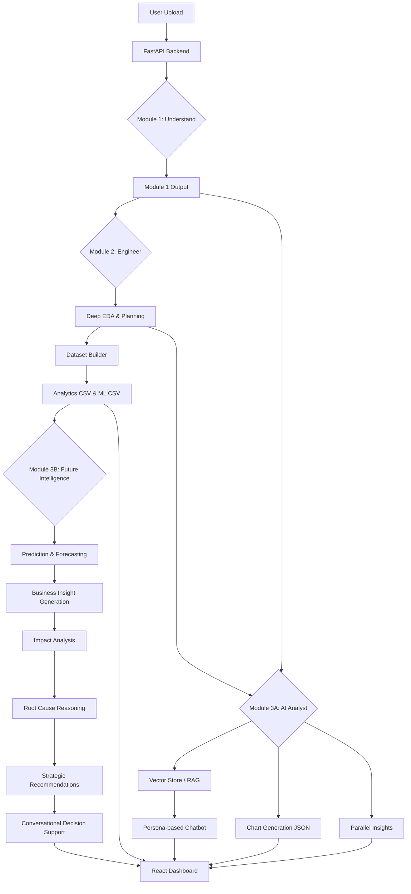

# Technical Architecture & Data Flow

This document details the internal logic and "brain" of the Data Intelligence Agent.

## 🧠 The Multi-Module Pipeline

The system processes data in three distinct phases to ensure human interpretability, machine readiness, and interactive AI analysis.

### Module 1: Data Understanding
**Goal**: Translate machine data (columns/rows) into a human business context.
1.  **Normalization**: Detects "disguised" nulls (e.g., "N/A", "-999", "?") and converts them to standard NaNs.
2.  **Hybrid Schema Detection**: Classifies columns (Numeric, Categorical, Datetime) and identifies potential "Unknown" types.
3.  **Column Intelligence**: If a column name is cryptic (e.g., `cnt_v1`), the LLM analyzes sample values to explain it.
4.  **Domain Detection**: Heuristics identify if the data is about Sales, HR, Healthcare, etc.
5.  **AI Summary**: Generates a 3-5 paragraph "Narrative" of what the dataset represents.

### Module 2: Intelligent Preprocessing
**Goal**: Transform raw data into structured artifacts for Machine Learning.
1.  **Deep EDA**: Calculates skewness, outlier percentages, and high-correlation pairs.
2.  **The Agent Planner**: We feed the EDA report and Module 1 summary into a Groq LLM. The agent returns a JSON plan.
3.  **Rule Engine**: Executes the agent's plan in a strict "Canonical Order" to prevent data leakage.
4.  **Target Detection**: Uses AI to guess which column is the "Target" (label).
5.  **Artifact Manager**: Saves trained encoders and scalers.

### Module 3A: Present-State Analytics & Dashboard
**Goal**: Provide an interactive present-state analytics interface backed by a RAG conversational agent using the human-readable dataset.
1.  **RAG Vector Store**: Converts the deep EDA and Module 1 summary into vector embeddings using `vector_store.py`.
2.  **Chart Engine**: Uses `llama-3.1-8b-instant` to generate a JSON configuration for 5-6 Plotly-compatible business charts.
3.  **Insights Engine**: Parallelized execution alongside chart generation to summarize data trends without UI lag.
4.  **Strict Persona Chatbot**: A chat endpoint that uses strict prompting to eliminate technical jargon, relying on the RAG context to answer user queries about their data.

### Module 3B: Future Intelligence Engine (AI Decision Intelligence)
**Goal**: Convert machine learning outputs into business-understandable future intelligence, strategic recommendations, and conversational decision support. 
**Core Philosophy**: Shift from traditional "ML Engineering" (feature importance, SHAP values, metrics) to "Executive-Level Business Intelligence" (future outcomes, business impact, strategic action).

1. **Future Prediction & Forecasting Layer (Internal Engine)**: Trains models on historical data to predict churn, sales, demand, etc., and build "Future Datasets" instead of simple raw graphs.
2. **Future Insight Generator**: Translates raw statistical predictions (e.g., "-18% forecast") into natural business language ("Sales may decrease next quarter...").
3. **Business Impact Analyzer**: Identifies the scale of predictions—which products, regions, and revenue streams are at risk, translating ML scores into business severity.
4. **AI Root Cause Engine**: Replaces traditional SHAP tables by combining ML trends, correlations, and LLM reasoning to explain *why* an event will happen in a business context.
5. **Strategy Recommendation Engine**: Converts insights into actionable solutions. Recommends what the company should do next (e.g., "Increase promotional campaigns in South region").
6. **Decision Intelligence Chat Agent**: Allows users to interactively query the future intelligence, ask "Why are sales decreasing?", and get contextual insights powered by the generated memory.
7. **Executive Report Generator**: Synthesizes the pipeline outputs into unified executive-level decision reports and future risk summaries.

## 🔄 Data Flow Diagram

## 🛠 Advanced Features

### Smart Target Detection
The system scans meaning keywords, the AI summary, and falls back to standard conventions.

### The Memory System
Module 2 includes a `PipelineMemory` class that tracks the success, failure, and duration of every step.

### Parallelized Execution & Rate Limit Handling
Module 3A is optimized for speed. Chart generation and insights are processed asynchronously, avoiding UI lag. Complex sequences of LLM requests are managed to prevent hitting API rate limits.

---
*Architecture documentation v2.0.1*
