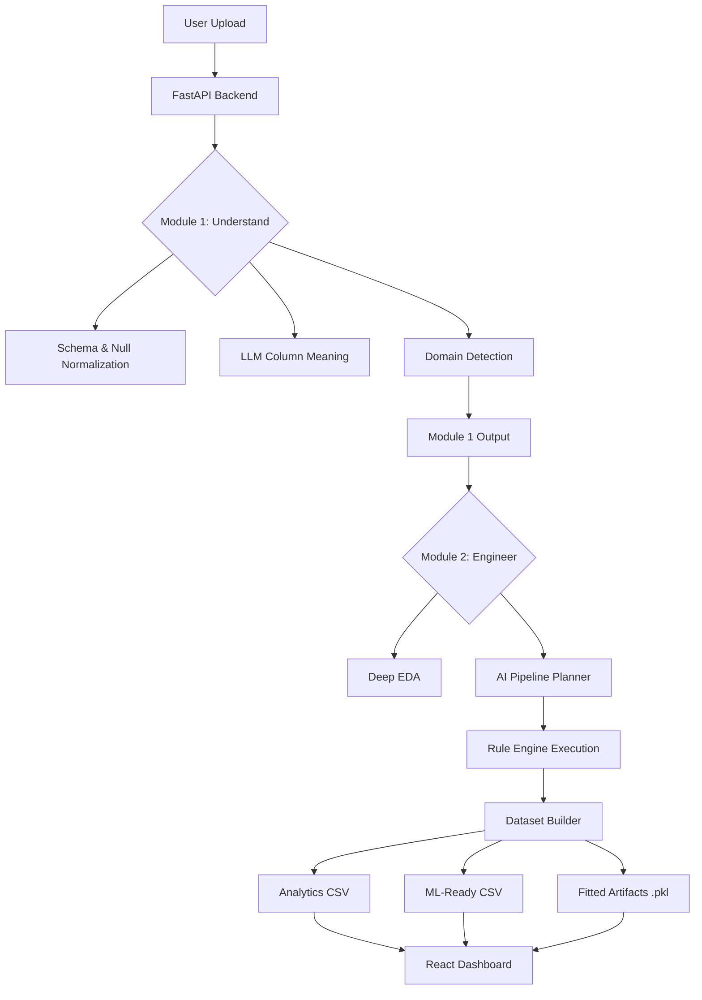

# Technical Architecture & Data Flow

This document details the internal logic and "brain" of the Data Intelligence Agent.

## 🧠 The Dual-Module Pipeline

The system processes data in two distinct phases to ensure both human interpretability and machine readiness.

### Module 1: Data Understanding
**Goal**: Translate machine data (columns/rows) into a human business context.
1.  **Normalization**: Detects "disguised" nulls (e.g., "N/A", "-999", "?") and converts them to standard NaNs.
2.  **Hybrid Schema Detection**: Classifies columns (Numeric, Categorical, Datetime) and identifies potential "Unknown" types.
3.  **Column Intelligence**: If a column name is cryptic (e.g., `cnt_v1`), the LLM analyzes sample values to explain it (e.g., "Total daily passenger count").
4.  **Domain Detection**: Heuristics identify if the data is about Sales, HR, Healthcare, etc.
5.  **AI Summary**: Generates a 3-5 paragraph "Narrative" of what the dataset represents.

### Module 2: Intelligent Preprocessing
**Goal**: Transform raw data into structured artifacts for Machine Learning.
1.  **Deep EDA**: Calculates skewness, outlier percentages, and high-correlation pairs.
2.  **The Agent Planner**: Our most unique feature. We feed the EDA report and Module 1 summary into a Groq LLM. The agent returns a JSON plan (e.g., `["handle_missing", "encoding", "scaling"]`).
3.  **Rule Engine**: Executes the agent's plan in a strict "Canonical Order" to prevent data leakage (e.g., always clean nulls before scaling).
4.  **Target Detection**: Uses AI to guess which column is the "Target" (label) based on the business context.
5.  **Artifact Manager**: Saves trained encoders and scalers. This allows you to apply the *exact same* transformations to new data in production.

## 🔄 Data Flow Diagram

## 🛠 Advanced Features

### Smart Target Detection
The system doesn't just look for a column named "target". It scans:
- **Meaning Keywords**: Detects words like "survival", "churn", or "outcome" in the column explanation.
- **AI Summary**: Checks if the AI narrative mentions a specific prediction goal.
- **Fallback**: Defaults to the last column (standard ML convention) if no intelligence is found.

### The Memory System
Module 2 includes a `PipelineMemory` class that tracks the success, failure, and duration of every step the AI chose to run. This is returned to the frontend to show the user exactly how their data was "cleaned".

---
*Architecture documentation v1.0*
