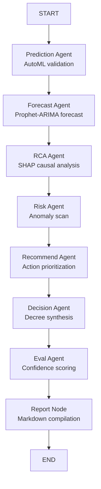

# Module 4 — Future Decision Intelligence Engine

Module 4 is the predictive brain of the Business Intelligence Platform. It ingests cleaned data from earlier phases to execute AutoML classification or regression, time-series forecasting, Root Cause Analysis (RCA), anomaly detection, and decision synthesis. It coordinates these tasks using an autonomous **LangGraph** workflow.

---

## 📂 Internal Structure

```text
module4/
├── main.py                          # Sub-app entry point (runs uvicorn on port 8004)
├── README.md                        # This local documentation
├── ingestion/
│   └── data_router.py               # Ingests datasets from Previous Modules
├── engines/
│   ├── prediction_engine.py         # AutoML Classification & Regression
│   ├── forecasting_engine.py        # Prophet + ARIMA Ensemble Forecaster
│   ├── rca_agent.py                 # SHAP-based statistical root cause analysis
│   ├── risk_engine.py               # Isolation Forest anomaly detection
│   ├── recommendation_engine.py     # Maps numeric signals to business remedies
│   ├── decision_engine.py           # Synthesizes all findings into a strategic decree
│   └── chat_agent.py                # Conversational helper for prediction queries
├── agents/
│   ├── agent_definitions.py         # Node wrapper implementations for the 7 agents
│   ├── agent_graph.py               # LangGraph StateGraph compilation
│   └── agent_runner.py              # Invocation script to run full graphs
├── explainability/
│   └── xai_layer.py                 # SHAP and LIME model explainers
├── monitoring/
│   └── model_monitor.py             # Accuracy tracking and statistical drift detector
├── schemas/
│   └── models.py                    # Strict Pydantic v2 request/response definitions
└── api/
    └── routes_4.py                  # FastAPI route controllers
```

---

## ⚡ The LangGraph State Machine

All analyses are executed through a compiled state machine (`agents/agent_graph.py`). Component agents update a shared, typed `AgentState` object sequentially:



---

## 📈 Component Engines

### 1. AutoML Prediction (`engines/prediction_engine.py`)
Automatically detects whether the target is classification or regression. Trains and validates multiple models (LightGBM, XGBoost, CatBoost, RandomForest, Ridge/LogisticRegression) using dynamic cross-validation (e.g. StratifiedKFold), select the best performer, and wraps it in a probability calibration layer (`CalibratedClassifierCV`).

### 2. Time-Series Forecasting (`engines/forecasting_engine.py`)
Splits date-aligned data into train and validation sets. Trains Prophet and auto_arima models, weights them inversely to their Mean Absolute Error (MAE), and runs future forecast steps with confidence intervals.

### 3. Root Cause Analysis (`engines/rca_agent.py`)
Fits a LightGBM model over cross-validation splits and uses SHAP (TreeExplainer) to compute feature impacts. Summarizes the top 5 contributing factors and their causal direction.

### 4. Explainability Layer (`explainability/xai_layer.py`)
Computes global feature importances via SHAP and fits local LIME explainer matrices to individual row items, returning feature-agreement alignment scores.

### 5. Telemetry & Drift Monitoring (`monitoring/model_monitor.py`)
Logs run metadata (time, engine type, confidence score). Establishes historical baselines and checks new incoming streams for statistical drift (checking if feature means shift by $>2$ standard deviations).

---

## 🚦 Unified Confidence Scoring

Every engine computes a structured `ConfidenceScore` on a `0.0` to `1.0` scale. The final pipeline confidence is a weighted average evaluated by the `EvalAgent`:
*   **`>= 0.90` (Very High)**: Safe to act on this result automatically.
*   **`>= 0.75` (High)**: Reliable result. Quick human verification suggested.
*   **`>= 0.55` (Moderate)**: Validate underlying assumptions.
*   **`>= 0.40` (Low)**: High uncertainty. Detailed expert review required.
*   **`< 0.40` (Uncertain)**: Do not act. Collect more data.

---

## 🚀 HTTP Endpoints & Examples

### 1. Start Sub-App Directly
```bash
cd Backend/module4
uvicorn api.routes_4:app --reload --port 8004
```

### 2. cURL Integration Examples

*   **Prediction (`POST /predict`)**:
    ```bash
    curl -X POST "http://localhost:8004/predict" \
      -H "Content-Type: application/json" \
      -d '{"data": [{"Age": 25, "Fare": 50, "Survived": 1}, {"Age": 30, "Fare": 10, "Survived": 0}], "target_column": "Survived"}'
    ```

*   **Forecasting (`POST /forecast`)**:
    ```bash
    curl -X POST "http://localhost:8004/forecast" \
      -H "Content-Type: application/json" \
      -d '{"data": [{"Date": "2026-01-01", "Value": 100}, {"Date": "2026-02-01", "Value": 110}], "date_column": "Date", "value_column": "Value", "periods": 2}'
    ```

*   **Run Complete LangGraph Pipeline (`POST /run-pipeline`)**:
    ```bash
    curl -X POST "http://localhost:8004/run-pipeline" \
      -H "Content-Type: application/json" \
      -d '{"data": [{"Age": 25, "Sex": 1, "Survived": 1}, {"Age": 30, "Sex": 0, "Survived": 0}], "target_column": "Survived", "problem": "Identify core survival vectors"}'
    ```
