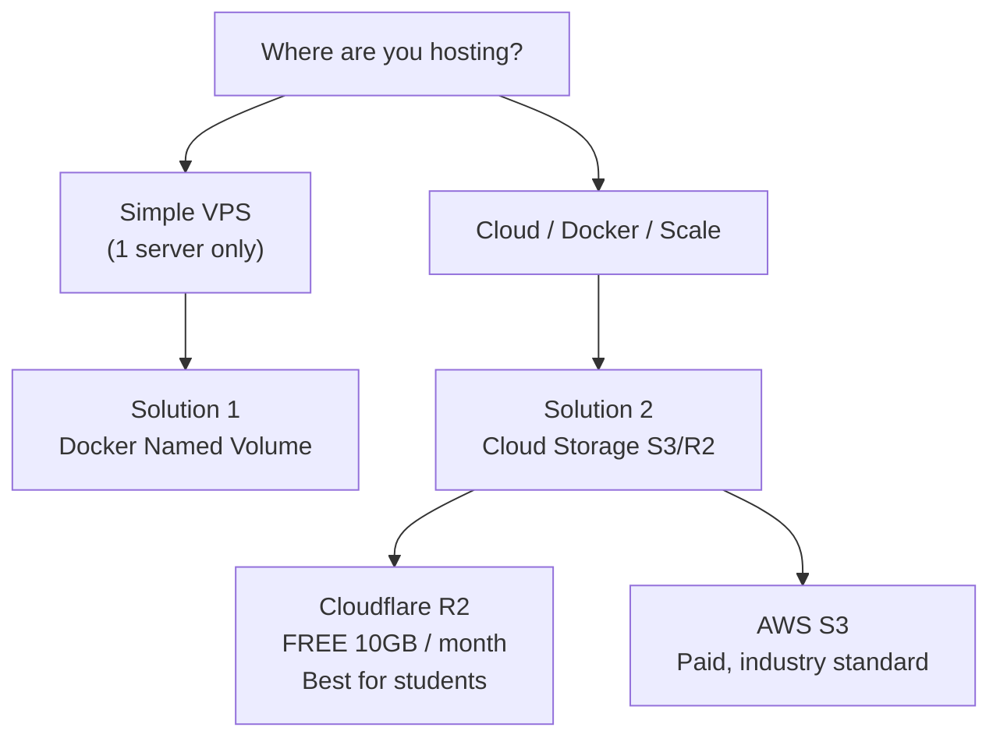

# Handling Artifacts & Exports When Hosting
### Problem → Solution Guide for AI Career Companion

---

## The Core Problem

Right now your code does this:

```python
# artifact_manager.py
DEFAULT_ARTIFACTS_DIR = "artifacts"          # local folder on disk
artifact_dir = os.path.join(base_dir, ...)
joblib.dump(encoder_map, paths["encoders"])  # saved to local disk

# exports saved as .csv files locally too
```

**When you host this on a server, local disk has 3 critical problems:**

| Problem | What Happens |
|---------|-------------|
| **Ephemeral containers** | Docker restarts = all local files gone |
| **No sharing** | If you scale to 2 servers, each has its own separate artifacts |
| **No backup** | Server crashes = all trained encoders/exports lost |

---

## The 3 Solutions (Pick One)



---

## Solution 1 — Docker Named Volume (Simplest, VPS only)

**No code changes needed.** Just mount persistent volumes in Docker.

```yaml
# docker-compose.yml
services:
  backend:
    volumes:
      - artifacts_data:/app/artifacts    # persists across restarts
      - exports_data:/app/exports        # persists across restarts

volumes:
  artifacts_data:    # Docker manages this on the host disk
  exports_data:
```

**Pros**: Zero code change, works today  
**Cons**: Only 1 server, no backup, still lost if you wipe the server

---

## Solution 2 — Cloud Object Storage (Recommended)

### Best Free Option: **Cloudflare R2**
- **10 GB free / month** — perfect for your `.pkl`, `.csv`, `.json` files
- S3-compatible API — same code works for AWS S3 later
- No egress fees (unlike AWS)

### Step 1 — Install the SDK

Add to `requirements.txt`:
```
boto3==1.34.0
```

### Step 2 — Add to `.env`

```env
# Cloudflare R2
STORAGE_BACKEND=s3
R2_ACCOUNT_ID=your_cloudflare_account_id
AWS_ACCESS_KEY_ID=your_r2_access_key
AWS_SECRET_ACCESS_KEY=your_r2_secret_key
R2_BUCKET_NAME=ai-career-artifacts
R2_ENDPOINT=https://<ACCOUNT_ID>.r2.cloudflarestorage.com

# OR for AWS S3
# STORAGE_BACKEND=s3
# AWS_ACCESS_KEY_ID=...
# AWS_SECRET_ACCESS_KEY=...
# AWS_DEFAULT_REGION=us-east-1
# S3_BUCKET_NAME=ai-career-artifacts
```

### Step 3 — Create `utils/storage.py`

```python
"""
utils/storage.py
================
Unified storage layer — transparently switches between
local filesystem (dev) and S3/R2 (production).

Set STORAGE_BACKEND=local  → saves to local disk (default, dev)
Set STORAGE_BACKEND=s3     → saves to Cloudflare R2 or AWS S3
"""

import os
import io
import json
import joblib
import boto3
from typing import Any
from dotenv import load_dotenv

load_dotenv()

STORAGE_BACKEND = os.getenv("STORAGE_BACKEND", "local")  # "local" or "s3"
BUCKET_NAME = os.getenv("R2_BUCKET_NAME") or os.getenv("S3_BUCKET_NAME")
ENDPOINT_URL = os.getenv("R2_ENDPOINT")  # None for AWS S3


def _get_s3_client():
    """Return a boto3 S3 client configured for R2 or AWS."""
    return boto3.client(
        "s3",
        endpoint_url=ENDPOINT_URL,           # R2 needs this, AWS S3 doesn't
        aws_access_key_id=os.getenv("AWS_ACCESS_KEY_ID"),
        aws_secret_access_key=os.getenv("AWS_SECRET_ACCESS_KEY"),
        region_name=os.getenv("AWS_DEFAULT_REGION", "auto"),
    )


# ── Save functions ─────────────────────────────────────────────────

def save_pickle(obj: Any, path: str) -> str:
    """
    Save a Python object as a .pkl file to local disk or cloud storage.

    Args:
        obj  : Any Python object (sklearn model, encoder, etc.)
        path : Relative path, e.g. "artifacts/run_001/encoders.pkl"

    Returns:
        The path/key where the file was saved.
    """
    if STORAGE_BACKEND == "s3":
        buffer = io.BytesIO()
        joblib.dump(obj, buffer)
        buffer.seek(0)
        _get_s3_client().upload_fileobj(buffer, BUCKET_NAME, path)
    else:
        os.makedirs(os.path.dirname(path), exist_ok=True)
        joblib.dump(obj, path)
    return path


def save_json(data: dict, path: str) -> str:
    """
    Save a dict as JSON to local disk or cloud storage.

    Args:
        data : Dictionary to serialize
        path : Relative path, e.g. "artifacts/run_001/metadata.json"

    Returns:
        The path/key where the file was saved.
    """
    content = json.dumps(data, indent=2, default=str).encode("utf-8")
    if STORAGE_BACKEND == "s3":
        _get_s3_client().put_object(
            Bucket=BUCKET_NAME,
            Key=path,
            Body=content,
            ContentType="application/json",
        )
    else:
        os.makedirs(os.path.dirname(path), exist_ok=True)
        with open(path, "w", encoding="utf-8") as f:
            f.write(content.decode())
    return path


def save_bytes(data: bytes, path: str, content_type: str = "application/octet-stream") -> str:
    """
    Save raw bytes (e.g. a CSV file) to local disk or cloud storage.

    Args:
        data         : Raw bytes to save
        path         : Relative path, e.g. "exports/report.csv"
        content_type : MIME type (default: application/octet-stream)

    Returns:
        The path/key where the file was saved.
    """
    if STORAGE_BACKEND == "s3":
        _get_s3_client().put_object(
            Bucket=BUCKET_NAME,
            Key=path,
            Body=data,
            ContentType=content_type,
        )
    else:
        os.makedirs(os.path.dirname(path), exist_ok=True)
        with open(path, "wb") as f:
            f.write(data)
    return path


# ── Load functions ─────────────────────────────────────────────────

def load_pickle(path: str) -> Any:
    """Load a .pkl file from local disk or cloud storage."""
    if STORAGE_BACKEND == "s3":
        buffer = io.BytesIO()
        _get_s3_client().download_fileobj(BUCKET_NAME, path, buffer)
        buffer.seek(0)
        return joblib.load(buffer)
    else:
        return joblib.load(path)


def load_json(path: str) -> dict:
    """Load a JSON file from local disk or cloud storage."""
    if STORAGE_BACKEND == "s3":
        obj = _get_s3_client().get_object(Bucket=BUCKET_NAME, Key=path)
        return json.loads(obj["Body"].read().decode("utf-8"))
    else:
        with open(path, "r", encoding="utf-8") as f:
            return json.load(f)


def generate_download_url(path: str, expires_in: int = 3600) -> str:
    """
    Generate a pre-signed download URL for a file (S3/R2 only).
    Falls back to a local path string in local mode.

    Args:
        path       : Storage key / file path
        expires_in : URL expiry in seconds (default: 1 hour)

    Returns:
        Pre-signed URL string (S3) or local file path (local).
    """
    if STORAGE_BACKEND == "s3":
        return _get_s3_client().generate_presigned_url(
            "get_object",
            Params={"Bucket": BUCKET_NAME, "Key": path},
            ExpiresIn=expires_in,
        )
    return path  # local fallback
```

### Step 4 — Update `artifact_manager.py` (3 line changes)

```python
# BEFORE
import joblib
joblib.dump(encoder_map, paths["encoders"])
joblib.dump(scaler_map,  paths["scalers"])
with open(paths["features"], "w") as f: json.dump(...)
with open(paths["metadata"], "w") as f: json.dump(...)

# AFTER — replace those 4 lines with:
from utils.storage import save_pickle, save_json
save_pickle(encoder_map, paths["encoders"])
save_pickle(scaler_map,  paths["scalers"])
save_json({"feature_columns": feature_cols}, paths["features"])
save_json(metadata, paths["metadata"])
```

### Step 5 — Update `dataset_builder.py` exports

```python
# BEFORE
df.to_csv("exports/file.csv", index=False)

# AFTER
from utils.storage import save_bytes
csv_bytes = df.to_csv(index=False).encode("utf-8")
save_bytes(csv_bytes, f"exports/{filename}.csv", content_type="text/csv")
```

---

## How File Download Works in Production

Instead of serving local files, generate a **pre-signed URL** — the browser downloads directly from cloud storage:

```python
# In your FastAPI download endpoint
from utils.storage import generate_download_url

@router.get("/download/{artifact_id}")
def download_export(artifact_id: str):
    key = f"exports/{artifact_id}.csv"
    url = generate_download_url(key, expires_in=3600)
    
    if STORAGE_BACKEND == "s3":
        return RedirectResponse(url)   # browser downloads from R2/S3
    else:
        return FileResponse(key)       # local dev: serve directly
```

---

## Summary: What to Do

| File | Change Needed |
|------|--------------|
| `utils/storage.py` | **CREATE** — unified storage layer |
| `module2/services/artifact_manager.py` | Replace `joblib.dump` / `open()` with `save_pickle` / `save_json` |
| `module2/services/dataset_builder.py` | Replace `df.to_csv(path)` with `save_bytes()` |
| `module4/outputs/report_generator.py` | Replace file writes with `save_bytes()` |
| `.env` | Add `STORAGE_BACKEND`, R2/S3 credentials |
| `docker-compose.yml` | Pass env vars into container |
| `requirements.txt` | Add `boto3==1.34.0` |

> [!TIP]
> **For your project right now**: Start with **Solution 1** (Docker volumes) to get hosted fast.
> Then migrate to **Cloudflare R2** (free, 10GB) when you need real persistence and backup.

> [!NOTE]
> **Local dev stays unchanged** — when `STORAGE_BACKEND=local` (default), all code behaves exactly as it does today. The switch to cloud is purely driven by the environment variable.
