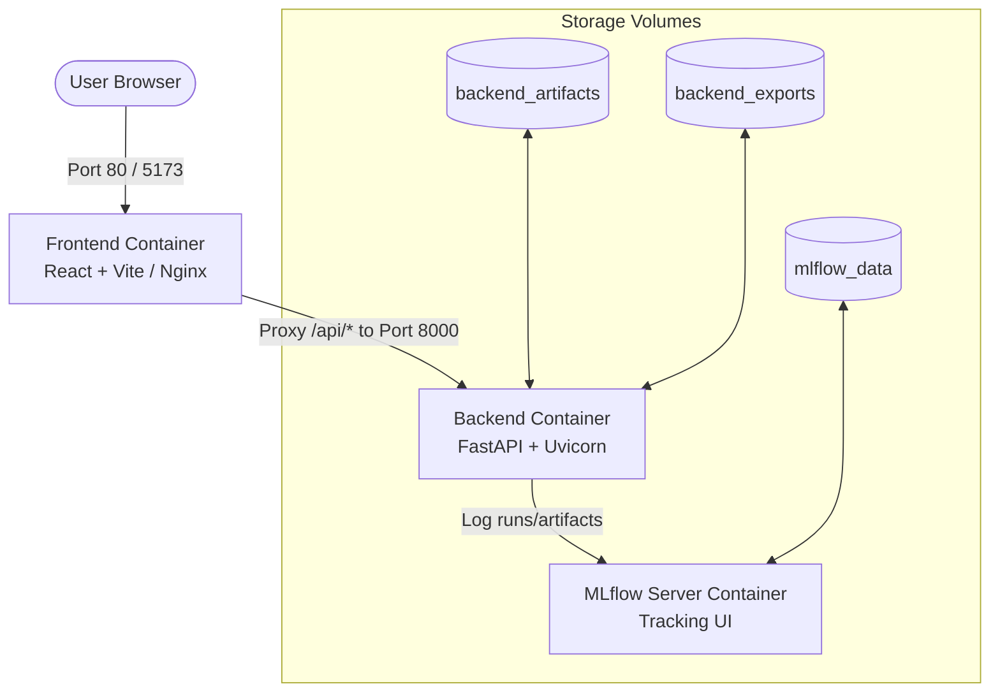

# Docker & Containerization Stack Guide

This guide provides a comprehensive overview of the newly added Docker configuration files, how they fit into the project architecture, and how to use them for both local development and production.

---

## 🏗️ Containerization Architecture

Below is a conceptual layout of the multi-container setup configured for this project:



---

## 📁 Created Configurations

The following files have been created in the workspace:

| File Path | Purpose | Key Optimization / Features |
| :--- | :--- | :--- |
| **`Backend/Dockerfile`** | Containerizes Python FastAPI service | Multi-stage slim build, ML dependencies (`xgboost`/`lightgbm`/etc.), standard-library-based health check, non-root security user (`appuser`). |
| **`frontend/Dockerfile`** | Containerizes React/Vite web application | Multi-stage build (Node builder + Nginx runtime for production hosting). |
| **`frontend/nginx.conf`** | Configures Nginx for Frontend serving | Implements **SPA routing** (redirects unmatched URLs to `index.html`), proxies `/api/` and `/downloads/` to the backend. |
| **`.dockerignore`** | Optimizes container builds | Prevents bloating containers with local virtual environments (`.venv`), node modules, logs, or sensitive `.env` credentials. |

---

## 🔒 Production Deployment Overview

In a production environment (such as GCP, AWS, or a custom VPS), images are built by a CI/CD pipeline (e.g. GitHub Actions) and pushed to a registry:

1. **Building Images**:
   ```bash
   docker build -t your-username/ai-career-companion/backend:latest ./Backend
   docker build -t your-username/ai-career-companion/frontend:latest ./frontend
   ```

2. **Deploying on Server (e.g., Cloud Run)**:
   For example, on Google Cloud Run, the backend container is built and run directly using the `Backend/Dockerfile`.

> [!TIP]
> **Why Multi-Stage Builds?**
> Standard Python and Node environments can result in images larger than 2GB. By compiling dependencies or building static bundles in the first stage and copying only the outputs to a minimal second stage, image sizes are reduced by up to **80%**, making deployments faster and reducing the attack surface.
