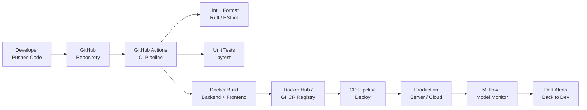
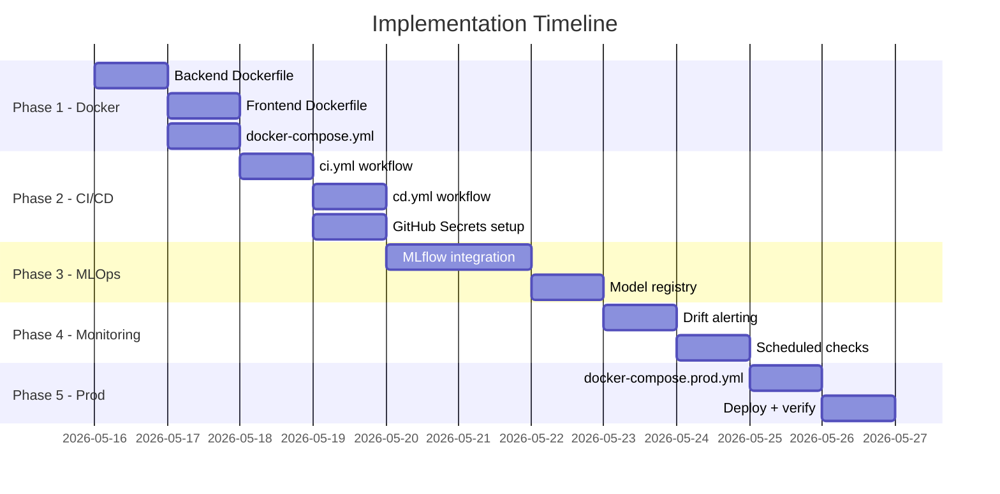

# MLOps · CI/CD · Docker — Implementation Plan
### Project: AI Career Companion (FastAPI + React + LangGraph)

> [!IMPORTANT]
> This plan is built specifically for **your** stack:
> - **Backend**: FastAPI + Uvicorn + scikit-learn / XGBoost / LightGBM / Prophet / LangGraph + Groq
> - **Frontend**: React 19 + Vite
> - **Git**: Already committed — ready to layer DevOps on top

---

## Overview



---

## Phase 1 — Dockerization (Day 1–2)

### 1.1  File Structure to Create

```
Project/Code/
├── Backend/
│   └── Dockerfile          ← NEW
├── frontend/
│   └── Dockerfile          ← NEW
├── docker-compose.yml      ← NEW
├── docker-compose.prod.yml ← NEW
└── .dockerignore           ← NEW
```

### 1.2  `Backend/Dockerfile`

```dockerfile
# ── Stage 1: builder ──────────────────────────────────────────────
FROM python:3.12-slim AS builder

WORKDIR /app

# Install build tools for heavy packages (LightGBM, CatBoost, etc.)
RUN apt-get update && apt-get install -y --no-install-recommends \
    gcc g++ make libgomp1 && rm -rf /var/lib/apt/lists/*

COPY requirements.txt .
RUN pip install --no-cache-dir --prefix=/install -r requirements.txt

# ── Stage 2: runtime ──────────────────────────────────────────────
FROM python:3.12-slim AS runtime

WORKDIR /app

# Copy installed packages from builder
COPY --from=builder /install /usr/local

# Copy application code
COPY . .

# Non-root user for security
RUN useradd -m appuser && chown -R appuser /app
USER appuser

EXPOSE 8000

HEALTHCHECK --interval=30s --timeout=10s --retries=3 \
    CMD curl -f http://localhost:8000/health || exit 1

CMD ["uvicorn", "main:app", "--host", "0.0.0.0", "--port", "8000"]
```

### 1.3  `frontend/Dockerfile`

```dockerfile
# ── Stage 1: build ────────────────────────────────────────────────
FROM node:20-alpine AS builder

WORKDIR /app
COPY package*.json ./
RUN npm ci --frozen-lockfile

COPY . .
RUN npm run build

# ── Stage 2: serve with Nginx ─────────────────────────────────────
FROM nginx:alpine AS runtime

COPY --from=builder /app/dist /usr/share/nginx/html
COPY nginx.conf /etc/nginx/conf.d/default.conf

EXPOSE 80

CMD ["nginx", "-g", "daemon off;"]
```

### 1.4  `frontend/nginx.conf`

```nginx
server {
    listen 80;

    location / {
        root   /usr/share/nginx/html;
        index  index.html;
        try_files $uri $uri/ /index.html;   # SPA routing
    }

    location /api/ {
        proxy_pass         http://backend:8000/;
        proxy_set_header   Host $host;
        proxy_set_header   X-Real-IP $remote_addr;
    }
}
```

### 1.5  `docker-compose.yml`  (Development)

```yaml
version: "3.9"

services:
  backend:
    build:
      context: ./Backend
      dockerfile: Dockerfile
    container_name: ai_career_backend
    ports:
      - "8000:8000"
    env_file:
      - ./Backend/.env
    volumes:
      - ./Backend:/app          # hot-reload for dev
      - backend_artifacts:/app/artifacts
    command: >
      uvicorn main:app --host 0.0.0.0 --port 8000 --reload
    healthcheck:
      test: ["CMD", "curl", "-f", "http://localhost:8000/health"]
      interval: 30s
      timeout: 10s
      retries: 3

  frontend:
    build:
      context: ./frontend
      dockerfile: Dockerfile
      target: builder          # dev stage (Vite dev server)
    container_name: ai_career_frontend
    ports:
      - "5173:5173"
    volumes:
      - ./frontend/src:/app/src
    command: npm run dev -- --host 0.0.0.0

  mlflow:
    image: ghcr.io/mlflow/mlflow:latest
    container_name: mlflow_server
    ports:
      - "5000:5000"
    volumes:
      - mlflow_data:/mlflow
    command: >
      mlflow server
        --host 0.0.0.0
        --port 5000
        --backend-store-uri /mlflow/tracking
        --default-artifact-root /mlflow/artifacts

volumes:
  backend_artifacts:
  mlflow_data:
```

### 1.6  `.dockerignore`

```
**/__pycache__
**/*.pyc
**/.env
**/node_modules
**/dist
**/.ruff_cache
**/logs
**/artifacts
**/.git
```

---

## Phase 2 — CI/CD with GitHub Actions (Day 3–4)

### 2.1  File Structure

```
.github/
└── workflows/
    ├── ci.yml          ← Runs on every PR / push to main
    └── cd.yml          ← Runs on merge to main (deploy)
```

### 2.2  `.github/workflows/ci.yml`

```yaml
name: CI Pipeline

on:
  push:
    branches: [main, develop]
  pull_request:
    branches: [main]

jobs:
  # ── Backend Checks ──────────────────────────────────────────────
  backend-lint:
    name: Backend Lint & Format
    runs-on: ubuntu-latest
    steps:
      - uses: actions/checkout@v4
      - uses: actions/setup-python@v5
        with: { python-version: "3.12" }
      - run: pip install ruff
      - run: ruff check Backend/ --output-format=github
      - run: ruff format Backend/ --check

  backend-test:
    name: Backend Unit Tests
    runs-on: ubuntu-latest
    needs: backend-lint
    steps:
      - uses: actions/checkout@v4
      - uses: actions/setup-python@v5
        with: { python-version: "3.12" }
      - run: pip install -r Backend/requirements.txt pytest pytest-asyncio httpx
      - name: Run tests
        env:
          GROQ_API_KEY: ${{ secrets.GROQ_API_KEY }}
        run: pytest Backend/tests/ -v --tb=short

  # ── Frontend Checks ─────────────────────────────────────────────
  frontend-lint:
    name: Frontend Lint
    runs-on: ubuntu-latest
    steps:
      - uses: actions/checkout@v4
      - uses: actions/setup-node@v4
        with: { node-version: "20" }
      - run: cd frontend && npm ci
      - run: cd frontend && npm run lint

  frontend-build:
    name: Frontend Build Check
    runs-on: ubuntu-latest
    needs: frontend-lint
    steps:
      - uses: actions/checkout@v4
      - uses: actions/setup-node@v4
        with: { node-version: "20" }
      - run: cd frontend && npm ci && npm run build

  # ── Docker Build Test ───────────────────────────────────────────
  docker-build:
    name: Docker Build Validation
    runs-on: ubuntu-latest
    needs: [backend-test, frontend-build]
    steps:
      - uses: actions/checkout@v4
      - uses: docker/setup-buildx-action@v3
      - name: Build Backend Image
        run: docker build ./Backend -t ai-career-backend:test
      - name: Build Frontend Image
        run: docker build ./frontend -t ai-career-frontend:test
```

### 2.3  `.github/workflows/cd.yml`

```yaml
name: CD Pipeline

on:
  push:
    branches: [main]

env:
  REGISTRY: ghcr.io
  BACKEND_IMAGE: ghcr.io/${{ github.repository }}/backend
  FRONTEND_IMAGE: ghcr.io/${{ github.repository }}/frontend

jobs:
  build-and-push:
    name: Build & Push Docker Images
    runs-on: ubuntu-latest
    permissions:
      contents: read
      packages: write

    steps:
      - uses: actions/checkout@v4

      - uses: docker/login-action@v3
        with:
          registry: ${{ env.REGISTRY }}
          username: ${{ github.actor }}
          password: ${{ secrets.GITHUB_TOKEN }}

      - uses: docker/setup-buildx-action@v3

      - name: Build & Push Backend
        uses: docker/build-push-action@v5
        with:
          context: ./Backend
          push: true
          tags: |
            ${{ env.BACKEND_IMAGE }}:latest
            ${{ env.BACKEND_IMAGE }}:${{ github.sha }}
          cache-from: type=gha
          cache-to: type=gha,mode=max

      - name: Build & Push Frontend
        uses: docker/build-push-action@v5
        with:
          context: ./frontend
          push: true
          tags: |
            ${{ env.FRONTEND_IMAGE }}:latest
            ${{ env.FRONTEND_IMAGE }}:${{ github.sha }}
          cache-from: type=gha
          cache-to: type=gha,mode=max

  deploy:
    name: Deploy to Production
    runs-on: ubuntu-latest
    needs: build-and-push
    environment: production

    steps:
      - uses: actions/checkout@v4
      - name: Deploy via SSH
        uses: appleboy/ssh-action@v1
        with:
          host: ${{ secrets.SERVER_HOST }}
          username: ${{ secrets.SERVER_USER }}
          key: ${{ secrets.SSH_PRIVATE_KEY }}
          script: |
            cd /app/ai-career-companion
            docker compose -f docker-compose.prod.yml pull
            docker compose -f docker-compose.prod.yml up -d --remove-orphans
```

---

## Phase 3 — MLOps with MLflow (Day 5–7)

### 3.1  What MLflow Tracks

| Component | What is Logged |
|-----------|---------------|
| `prediction_engine.py` | Model name, accuracy, F1, MAE, R², feature count |
| `forecasting_engine.py` | MAPE, RMSE, confidence intervals |
| `rca_agent.py` | RCA confidence scores, correlation strength |
| Model artifacts | Serialized `.pkl` / `.joblib` models per run |

### 3.2  Install MLflow

Add to `requirements.txt`:
```
mlflow==2.13.0
```

### 3.3  MLflow Integration in `prediction_engine.py`

```python
import mlflow
import mlflow.sklearn

# At the top of train_and_predict():
mlflow.set_tracking_uri("http://mlflow:5000")
mlflow.set_experiment("prediction-engine")

with mlflow.start_run(run_name=f"predict_{target_col}"):
    # Log parameters
    mlflow.log_param("model", best_model_name)
    mlflow.log_param("target_col", target_col)
    mlflow.log_param("n_features", len(feature_cols))
    mlflow.log_param("task_type", task_type)

    # Log metrics
    mlflow.log_metric("accuracy", accuracy)
    mlflow.log_metric("f1_score", f1)
    mlflow.log_metric("r2_score", r2)

    # Log the model artifact
    mlflow.sklearn.log_model(best_model, "model")
```

### 3.4  Model Registry Workflow

```
Train → Log to MLflow → Register Model → Staging → Production
                                ↕
                         model_monitor.py
                         detects drift →
                         triggers re-train
```

---

## Phase 4 — Model Monitoring & Drift Detection (Day 8–9)

Your `model_monitor.py` already has `detect_drift()`. Wire it to MLflow:

```python
# In model_monitor.py → detect_drift()
import mlflow

def detect_drift(self, new_data: dict) -> dict:
    result = super().detect_drift(new_data)
    
    # Log drift event to MLflow
    with mlflow.start_run(run_name="drift-check", nested=True):
        mlflow.log_metric("drift_score", result.get("drift_score", 0))
        mlflow.log_metric("is_drifted", int(result.get("drifted", False)))
    
    return result
```

**Alerting**: Add a GitHub Actions scheduled workflow to run drift checks daily:

```yaml
# .github/workflows/drift_check.yml
on:
  schedule:
    - cron: '0 2 * * *'   # Every day at 2 AM UTC

jobs:
  drift-check:
    runs-on: ubuntu-latest
    steps:
      - name: Run drift detection
        run: |
          curl -X POST http://${{ secrets.SERVER_HOST }}:8000/module4/monitor/drift \
            -H "Content-Type: application/json"
```

---

## Phase 5 — Production `docker-compose.prod.yml`

```yaml
version: "3.9"

services:
  backend:
    image: ghcr.io/YOUR_USERNAME/ai-career-companion/backend:latest
    container_name: ai_career_backend
    restart: always
    env_file: ./Backend/.env.prod
    volumes:
      - backend_artifacts:/app/artifacts
    expose:
      - "8000"

  frontend:
    image: ghcr.io/YOUR_USERNAME/ai-career-companion/frontend:latest
    container_name: ai_career_frontend
    restart: always
    ports:
      - "80:80"
      - "443:443"

  mlflow:
    image: ghcr.io/mlflow/mlflow:latest
    restart: always
    volumes:
      - mlflow_data:/mlflow
    expose:
      - "5000"
    command: >
      mlflow server
        --host 0.0.0.0 --port 5000
        --backend-store-uri /mlflow/tracking
        --default-artifact-root /mlflow/artifacts

volumes:
  backend_artifacts:
  mlflow_data:
```

---

## GitHub Secrets Required

| Secret Name | What It Is |
|-------------|-----------|
| `GROQ_API_KEY` | Your Groq API key |
| `SERVER_HOST` | Production server IP/hostname |
| `SERVER_USER` | SSH username |
| `SSH_PRIVATE_KEY` | Private SSH key for deployment |

> [!TIP]
> Go to: **GitHub Repo → Settings → Secrets and variables → Actions → New repository secret**

---

## Recommended Execution Order



---

## Quick Start Commands

```bash
# 1. Build & run locally
docker compose up --build

# 2. Access services
#    Frontend:  http://localhost:5173
#    Backend:   http://localhost:8000/docs
#    MLflow UI: http://localhost:5000

# 3. Run tests inside container
docker exec ai_career_backend pytest tests/ -v

# 4. Check health
curl http://localhost:8000/health
```

---

> [!NOTE]
> **Start with Phase 1 (Docker)** — it is the foundation everything else builds on.
> Once containers run locally, CI/CD and MLOps layers drop in cleanly on top.
